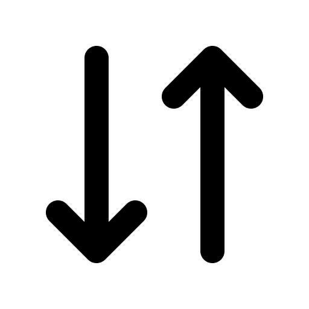

# Sync



A lightweight macOS menu bar app for file synchronization powered by [rclone](https://rclone.org).

## Features

- Menu bar interface — always accessible, never in the way
- Multiple sync configurations with independent schedules
- Sync directions: remote→local, local→remote, or bidirectional
- Sync modes: mirror (with deletions) or copy (additive only)
- Automatic sync on file changes via FSEvents
- Interval-based scheduled sync
- Bandwidth limiting, exclude patterns, custom rclone flags
- Dry run to preview changes before syncing
- Backup of deleted files with timestamps
- Start on login

## Requirements

- macOS 15+
- [rclone](https://rclone.org/install/) (`brew install rclone`)

## Install

```
make install
```

Or use the build script which also restarts the app:

```
./build.sh
```

## Setup

1. Configure rclone remotes first: `rclone config`
2. Launch Sync — it appears in the menu bar
3. Click the menu bar icon → Manage Syncs → add a sync configuration
4. Set the remote path (e.g. `gdrive:Documents`), local folder, direction, and schedule

## License

MIT
